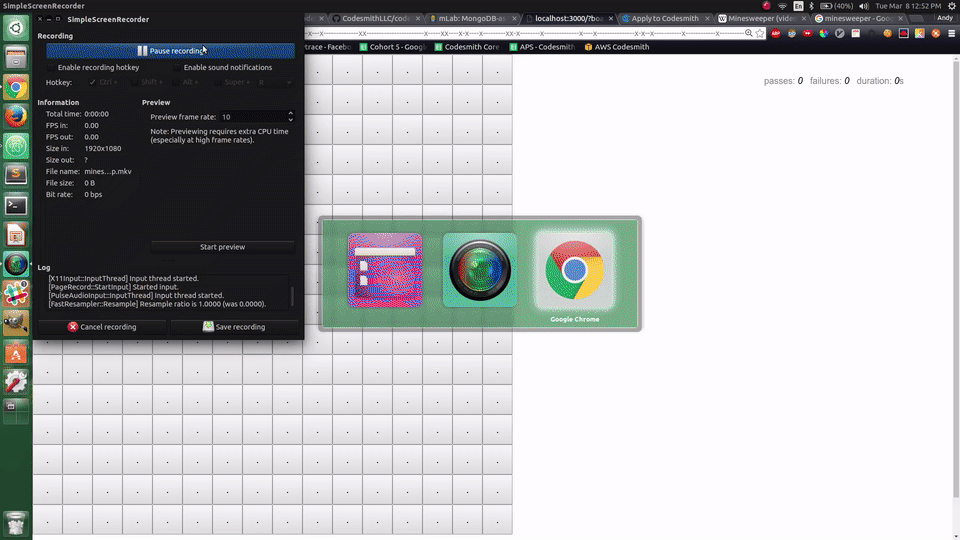

# Codesmith Take Home

## Summary
Congratulations on making it to the Take Home portion of the Senior Software Engineer application process with Codesmith. You will have four days to complete this take home and send us a zipped file with your completed version. We recommend spending roughly 6 hours on the task. The more you are able to communicate your thought process when building it, the better.

## The Challenge
You will implement a browser-based version of the puzzle game [Minesweeper](https://en.wikipedia.org/wiki/Minesweeper_(video_game)) as a React / Node application.

### The Game Rules
The board is a grid of 256 (16x16) buttons which have hidden values. To play, you click the buttons one by one. Clicking a button uncovers its value.

- Uncover a mine, and you lose.
- Uncover an empty square, and you keep playing.
- Uncover a number, and it tells you how many mines lay hidden in the eight surrounding squares. This information is used to deduce which nearby squares are safe to click.

The goal is to avoid clicking the mines. Uh oh! In the example below, they made a lot of progress but ended up clicking a mine...


If a mine is hit, the game is over.

If all cells _except_ mines are revealed, the player wins.

## Getting Started
Take a look at the boilerplate architecture. There are a few scripts available to you, but the main one you will likely want is:

- `npm run dev`: this starts up both the frontend React app (using webpack-dev-server) and backend Node server

The React app is served on `http://localhost:3000`.

The Node server is running on `http://localhost:8080`.

webpack-dev-server is configured to proxy requests from the React app that start with `/api` to the Node server.

## Requirements
You must use React, Node, and Express. It is up to you whether or not to use any other libraries / frameworks. If you do, please remmeber to include them in your `package.json`.

You'll need to create a board as a grid of 16 X 16 buttons.

In the `server/data` directory you will find an array of possible board layouts. 

### Layout Key:
- `x` denotes a mine, 
- `-` denotes either a number or an underscore
  - number: the value should be the total number of mines touching this space.
  - underscore: use this when there are no surrounding mines touching this space.

There are multiple ways a player can start a game:

1. By going to `http://localhost:3000`: This will randomly select one of the default layouts from the `server/data` directory
1. By including a `layoutIndex` param in the query string (i.e. `http://localhost:3000?layoutIndex=1`): This will populate the layout at the specified index. If no layout exists at a given index, an error should be returned and displayed to the player.
1. By including a `board` param in the query string with a specific board layout to use. For example:

```
// board layout should match the `board` query string value
http://localhost:3000/?board=x---x-x----x--x--------x----x-x----xxx----x---x---x--------------xx-----------------------x-----xx----x-x----x---------xx-x--------x--------------x----x---------------x-x--x-----------x------------x------------x-----xxxx----x---------------------------x---
```

will produce a board that looks like this:


Values by default should be hidden on load. Only by clicking a cell does it reveal the value:



### Checklist of Requirements
- [ ] When you visit `http://localhost:3000/` in the browser, it should serve the `index.html`
- [ ] If no `board` query string provided, randomly select default board layout
- [ ] If `layoutIndex` endpoint is hit, and it is a valid layout, the specified layout should be used
- [ ] If `board` query string provided, and it is a valid layout, use value as board layout
- [ ] Existing layouts should be served from the Node server
- [ ] The board values should follow the rules listed in the layout key above
- [ ] If a mine is hit, the player should lose
- [ ] If no mines are hit and all other values are revealed, the player should win
- [ ] A player should be able to restart the game at any time from within the app (without needing a browser refresh)

## Additional Notes
- There are no specific UI requirements as long as the base functionality is available. However, we encourage you to show off your design skills. You are free to use any styling library you wish (or none at all).
- The checklist above hits all the basic requirements and you are **NOT** required to complete any of the following. If you choose to, here are some additional stretch features:
  1. Allow players to add and store their own boards to the default layouts array so that future users have more randomized options
  1. Keep track of how many games a player has won and store score across browser refreshes
  1. Create a leaderboard of other players scores and who has the best all-time score
  1. Incorporate unit testing
  1. Deploy the application on a hosting platform of your choice
  